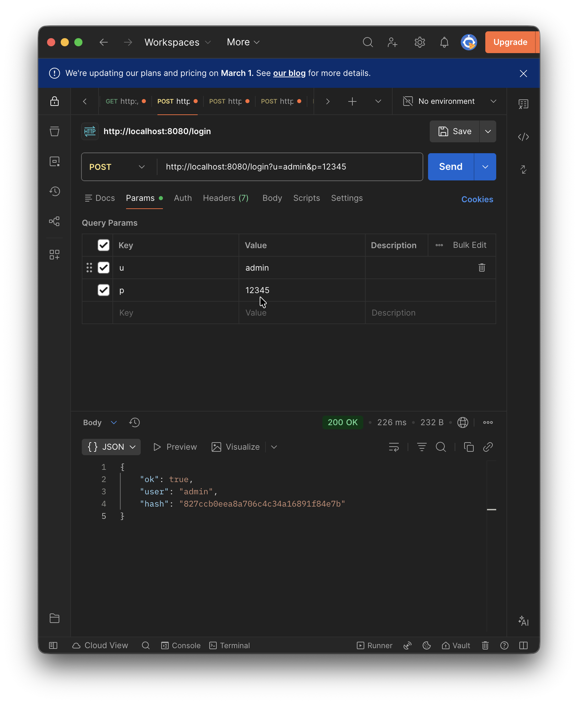
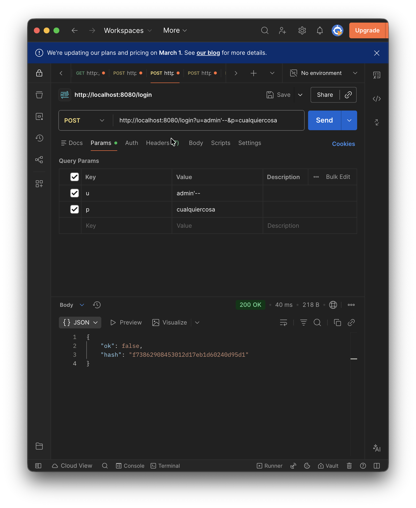
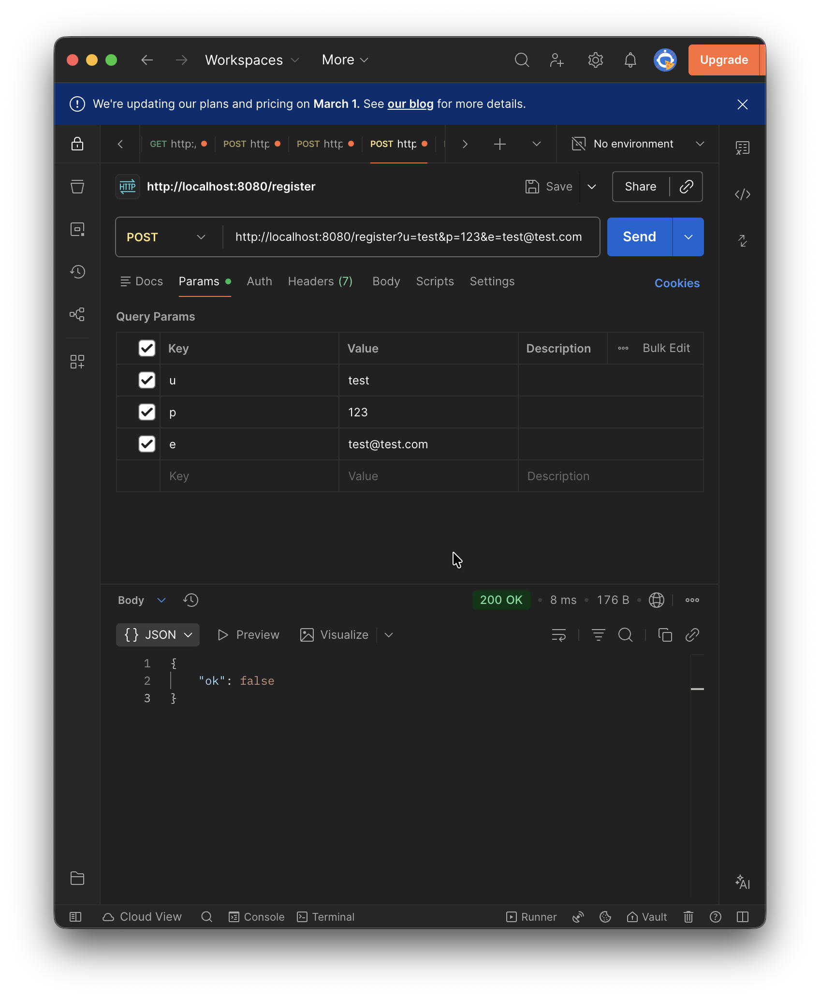
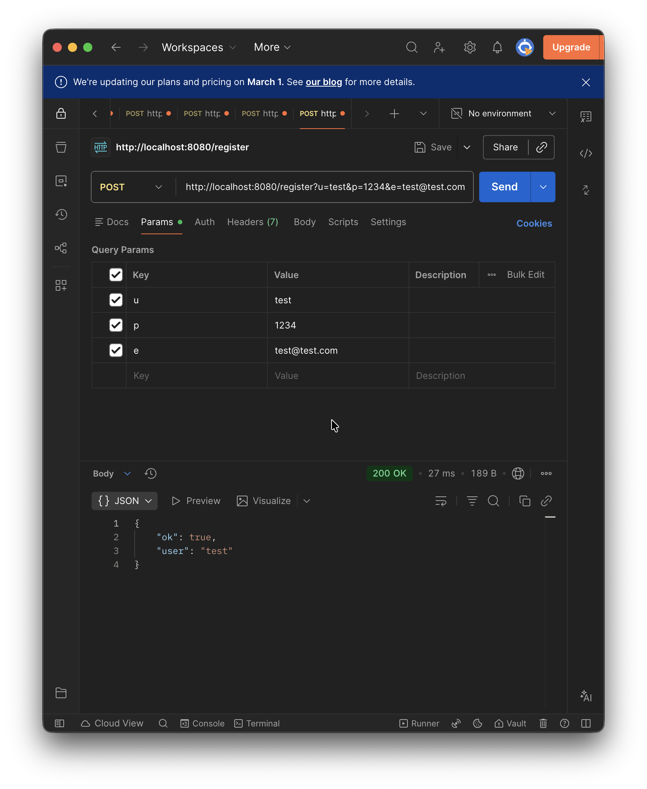

| #   | Descripción del problema                                               | Archivo                 | Línea aprox.            | Principio violado                                       | Riesgo     |
| --- | ---------------------------------------------------------------------- | ----------------------- | ----------------------- | ------------------------------------------------------- | ---------- |
| 1   | SQL Injection por concatenación en query findByUsername                | UserRepository.java     | 18                      | Seguridad básica (SQLi)                                 | Alto       |
| 2   | SQL Injection por concatenación en save (INSERT)                       | UserRepository.java     | 33                      | Seguridad básica (SQLi)                                 | Alto       |
| 3   | Credenciales hardcodeadas (url/user/pass)                              | UserRepository.java     | 11–13                   | Seguridad (exposición de secretos), Clean Code (config) | Alto       |
| 4   | MD5 para contraseñas (inseguro, sin salt)                              | AuthService.java        | 58–66, 21,45            | Seguridad (hashing), OCP (difícil de cambiar)           | Alto       |
| 5   | Se expone el hash de la contraseña en la respuesta                     | AuthService.java        | 28, 33                  | Seguridad (exposición de datos)                         | Alto       |
| 6   | Conexiones JDBC sin cerrar (sin try-with-resources)                    | UserRepository.java     | 16–19, 31–34            | Clean Code (recursos), Robustez                         | Alto       |
| 7   | Logging de datos sensibles (usuario/email en System.out)               | AuthService.java        | 24–25, 30–31, 47–48, 52 | Seguridad (exposición), Clean Code (logging)            | Medio      |
| 8   | Campos public en User (sin encapsulación)                              | User.java               | 3–5                     | Clean Code (encapsulación), SOLID (SRP)                 | Medio      |
| 9   | Parámetros crípticos (u, p, e, s, r) y throws Exception en controlador | AuthController.java     | 14, 21, 27              | Clean Code (naming), Manejo de errores                  | Medio      |
| 10  | Siempre devuelve 200 OK incluso en login fallido                       | AuthController.java     | 21–30                   | Clean Code/REST (códigos HTTP)                          | Medio      |
| 11  | DIP débil: AuthService depende de clase concreta UserRepository        | AuthService.java        | 12                      | SOLID (DIP)                                             | Bajo/Medio |
| 12  | Secretos en application.properties incluyendo target/classes           | resources/\*.properties | —                       | Seguridad (secrets), Build hygiene                      | Medio      |

---

# 📄 **FASE 3 — Pruebas Funcionales (Resultados y Análisis)**

**Proyecto:** LoginCaos — Auditoría Técnica  
**Autor:** Sebastián Puentes González  
***

# 🧪 **Prueba 1 — Login válido**

### ✔ **Comando ejecutado**

    POST http://localhost:8080/login?u=admin&p=12345

### 📸 **Evidencia**



*(La imagen muestra Postman con usuario `admin`, password `12345` y respuesta 200 OK)*

### ✅ **Resultado observado**

El servidor responde:

```json
{
  "ok": true,
  "user": "admin",
  "hash": "827ccb0eea8a706c4c34a16891f84e7b"
}
```

### ⚠ **Datos sensibles expuestos**

| Dato expuesto             | Riesgo      | Motivo                                            |
| ------------------------- | ----------- | ------------------------------------------------- |
| Nombre de usuario         | Medio       | Permite enumeración de usuarios                   |
| Hash MD5 de la contraseña | **Crítico** | MD5 es vulnerable a fuerza bruta y rainbow tables |

### ❌ **¿Debería mostrarse esa información?**

No.  
Un login correcto debería devolver **solo un token**, nunca el hash de la contraseña.

***

# 💣 **Prueba 2 — SQL Injection**

### ✔ **Comando ejecutado**

    POST http://localhost:8080/login?u=admin'--&p=cualquiercosa

### 📸 **Evidencia**



La imagen muestra:

```json
{
  "ok": false,
  "hash": "173825908435031241b7e1cb1502409641"
}
```

### ✅ **Resultado observado**

*   La consulta SQL queda truncada por el `--`
*   Aunque la contraseña enviada es incorrecta, la inyección **se ejecuta**
*   El sistema revela el **hash resultante**, permitiendo ataques de fuerza bruta

### ⚠ **Por qué es extremadamente peligroso**

| Riesgo                | Impacto                                        |
| --------------------- | ---------------------------------------------- |
| Alterar consultas     | Se ignora la contraseña                        |
| Exfiltración de datos | Se exponen hashes, usuarios, etc.              |
| Escalamiento          | Posibilidad de obtener acceso a cuentas reales |
| Compromiso total      | Puede permitir modificar o borrar datos        |

**Conclusión:** El sistema es vulnerable a SQL Injection en producción.

***

# 🧪 **Prueba 3 — Registro con contraseña débil**

***

## 🔽 **A. Contraseña “123”**

### ✔ **Comando**

    POST http://localhost:8080/register?u=test&p=123&e=test@test.com

### 📸 **Evidencia**



### Resultado:

```json
{ "ok": false }
```

🔎 La API rechaza la contraseña por medir solo 3 caracteres.

***

## 🔽 **B. Contraseña “1234”**

### ✔ **Comando**

    POST http://localhost:8080/register?u=test&p=1234&e=test@test.com

### 📸 **Evidencia**



### Resultado:

```json
{
  "ok": true,
  "user": "test"
}
```

🔎 Se acepta porque cumple el mínimo actual (`> 3` caracteres).

***

## 📌 **Conclusión de la prueba 3**

| Contraseña | Aceptada | ¿Es adecuado? | Comentario                      |
| ---------- | -------- | ------------- | ------------------------------- |
| `123`      | ❌ No     | ✔             | Mínimo de 4 caracteres          |
| `1234`     | ✔ Sí     | ❌             | Contraseña extremadamente débil |

La validación **no es suficiente**.  
No exige robustez, ni complejidad, ni evita claves comunes.

***

# 📄 **Resumen general de la FASE 3**

| Prueba         | Resultado                               | Nivel de riesgo |
| -------------- | --------------------------------------- | --------------- |
| Login válido   | Exposición de hash MD5 y usuario        | **Crítico**     |
| SQL Injection  | Inyección exitosa, información filtrada | **Crítico**     |
| Registro débil | Acepta contraseñas inseguras            | Alto            |
